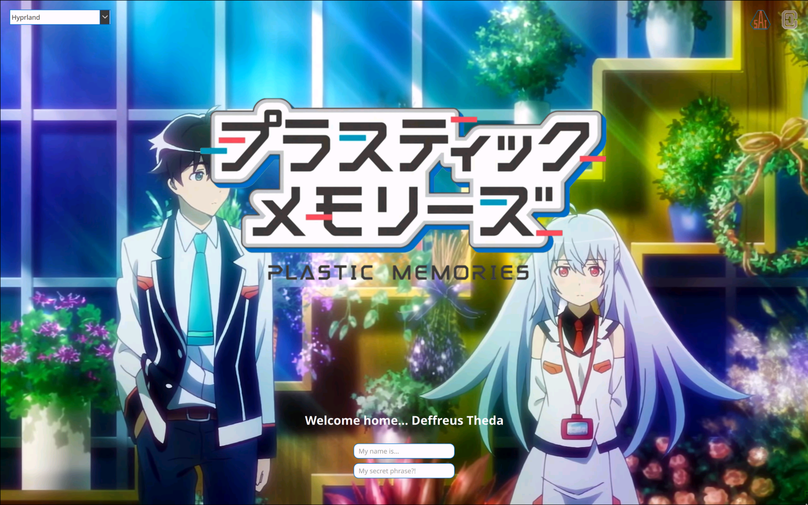

# SDDM Plastic Memories Theme

<div align="center"></div>

> [!IMPORTANT]
> This is an unofficial theme.<br>
> I do not own the opening video and music, nor the title images.<br>
> This theme will be removed if the copyright holders requested so.

A SDDM theme inspired by 2015 Anime ["Plastic Memories"](https://en.wikipedia.org/wiki/Plastic_Memories)

You can watch the preview video [here](preview.mp4) (WIP)

## Installation

Dependencies:

- [`sddm`](https://github.com/sddm/sddm)
- `git-lfs`
- `qt5-multimedia`
- `qt5-quickcontrols`
- .mp4 audio and video codecs e.g. gstreamer1 'libav' plugin

On Fedora: `sudo dnf install -y sddm git-lfs qt5-qtmultimedia qt5-qtquickcontrols gstreamer1-plugin-libav`

```sh
#: Clone this theme
git clone https://github.com/DeffreusTheda/sddm-plastic-memories

#: Run installer from repo directory,
#: as install.sh does use relative path
cd sddm-plastic-memories
./install.sh
```

What `install.sh` does:

1. Download the opening video from Git LFS
2. Copy theme files to `/usr/share/sddm/themes/sddm-plastic-memories/` directory
3. Automatically edit `/etc/sddm.conf` to use this theme
4. Add read and write permission for `theme.conf.user`
5. Open `theme.conf.user` with `$EDITOR` or `vi` as fallback (Optional)

> [!NOTE]
> Please enter your `sudo` password whenever asked

Thank you for using this theme! ^-^

## Configuration

Edit `/usr/share/sddm/themes/sddm-plastic-memories/theme.conf.user` after installation

```sh
$EDITOR /usr/share/sddm/themes/sddm-plastic-memories/theme.conf.user
```

## Preview/Testing

Run the `test.sh` file

```sh
/usr/share/sddm/themes/sddm-plastic-memories/test.sh
```

## Issues or Bugs ?!

Please [open an issue](https://github.com/DeffreusTheda/sddm-plastic-memories/issues/new), describing your problem with relevant images, logs, or other source of information.

## Developer "Note"

<details><summary>A bit of rant...</summary>
	This theme is a fork of https://github.com/lll2yu/sddm-lain-wired-theme by lll2yu, btw.<br>
	It gotten to the point that it's not a fork anymore, I think (?).<br>
	I spent 3 (holi)days to make this all.<br>
	Before this, I shared my Isla themed desktop setup in a Discord server, but nobody really liked it.<br>
	I don't know, I don't felt enough, so here I am with this SDDM theme.<br>
	It turned out pretty good though, amirite?<br>
	Got paranoid with copyright infringement at day 2, but I don't think Doga Kobo really care (I hope so @_@).<br>
	Y291bGQgeW91IHBsZWFzZSBjdXJlIG15IGxvbmVsaW5lc3MgYWFhYWFhYWFhYWFhYWFhYWFhYWEK<br>
	plase help
</details>
